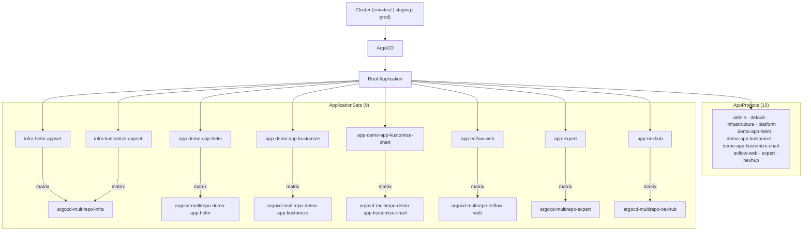

# ArgoCD Multi-Repo Demo

Multi-team GitOps setup using the **App of Apps** pattern with **ApplicationSets**.

A single root Application watches the `argocd/` directory in this repo. That directory contains AppProjects (RBAC boundaries) and ApplicationSets (templated app generators). Each ApplicationSet uses a `matrix(clusters x git)` generator to scan a team's repo and produce one Application per environment cluster - so adding a new environment or a new app component requires zero changes to the root repo. The root Application syncs the control plane; the ApplicationSets sync the actual workloads.

## Repositories

| Repo | Role |
|---|---|
| [argocd-multirepo-root](https://github.com/recmanj/argocd-multirepo-root) (this) | Bootstrap + AppProjects + ApplicationSets |
| [argocd-multirepo-infra](https://github.com/recmanj/argocd-multirepo-infra) | Platform infrastructure (ArgoCD, cert-manager, CloudNativePG, observability) |
| [argocd-multirepo-demo-app-helm](https://github.com/recmanj/argocd-multirepo-demo-app-helm) | Demo app - Helm (backend + frontend) |
| [argocd-multirepo-demo-app-kustomize](https://github.com/recmanj/argocd-multirepo-demo-app-kustomize) | Demo app - Kustomize |
| [argocd-multirepo-demo-app-kustomize-chart](https://github.com/recmanj/argocd-multirepo-demo-app-kustomize-chart) | Demo app - Kustomize helmCharts |
| [argocd-multirepo-ecflow-web](https://github.com/recmanj/argocd-multirepo-ecflow-web) | ecflow-web team (Kustomize) |
| [argocd-multirepo-expert](https://github.com/recmanj/argocd-multirepo-expert) | expert team (Kustomize) |
| [argocd-multirepo-nexhub](https://github.com/recmanj/argocd-multirepo-nexhub) | nexhub team (Kustomize) |
| [shared-workflows](https://github.com/recmanj/shared-workflows) | Reusable GitHub Actions (build, promote) |

## Architecture



Every ApplicationSet uses a `matrix(clusters x git)` generator - one Application per cluster `env` label.

## Bootstrap

```bash
just install-argocd          # 1. Install ArgoCD on the cluster
just bootstrap test          # 2. Bootstrap environment (test | staging | prod)
```

The bootstrap Helm chart creates a root Application (points at `argocd/`), a cluster secret with the `env` label, and the `admin` AppProject.

## Promotion Workflow

App repos use the reusable [promote-app](https://github.com/recmanj/shared-workflows/blob/main/.github/workflows/promote-app.yaml) GitHub Actions workflow from `shared-workflows` to promote versions across environments.

**How it works:**

1. An app's CI calls the workflow with the target environment, version, and deployment type
2. The workflow checks out the ArgoCD repo and updates the version:
   - **Helm** - sets `version` in `config.json`
   - **Kustomize** - sets the image tag in `versions.yaml`
3. Closes any stale open promotion PRs for the same app + environment
4. Creates a PR titled `Promote <app>:<version> to <env>`
5. Auto-merges the PR for configured environments (default: `test`)

This gives teams a PR-based audit trail for every deployment while keeping test promotions fast.

## Environment Overlays

Each app repo has a **base** layer and per-environment **overlays** that override it:

```
<app>/
  base/           ← production-ready defaults (Kustomize) or values.yaml (Helm)
  envs/
    test/         ← overrides for test only
    staging/      ← overrides for staging only
    prod/         ← overrides for prod only
```

**Base = production config.** The base layer should always reflect what runs in production (image version, replicas, resource limits). Non-prod overlays then scale things _down_ - fewer replicas, smaller resource limits, debug flags, test domains.

**Why this ordering matters:** When a new version is first promoted (e.g. to test), it can't go straight into base because it hasn't been validated yet. So the promotion workflow writes the new version into the test overlay. Once it reaches prod and is verified, move the version from the prod overlay into base and remove the per-env overrides. This keeps base as the source of truth for what's proven in production and prevents overlays from accumulating stale drift.

## AppProjects & RBAC

Each team gets an [AppProject](https://argo-cd.readthedocs.io/en/stable/user-guide/projects/) that restricts what it can deploy:

- **sourceRepos** - only that team's git repo (and chart repo for Helm teams)
- **destinations** - only that team's namespace
- **namespaceResourceWhitelist** - workload resources only (Deployment, Service, Ingress, etc.)

Teams cannot deploy to other namespaces, create ClusterRoles, or reference repos they don't own. The `infrastructure` project has broader access (CRDs, ClusterIssuers, cross-namespace PG clusters) and is managed by the platform team only.

**Connecting to an IdP:** ArgoCD RBAC roles map to groups from OIDC/SSO. Once SSO is configured, bind IdP groups to roles in the ArgoCD RBAC policy (`argocd-multirepo-infra/infra-helm/argo-cd/values.yaml`):

```csv
p, role:expert-team, *, *, expert/*, allow
g, myorg:expert-team, role:expert-team
```

This gives the `myorg:expert-team` group (from the IdP) full access to the `expert` project's Applications, while all other projects remain invisible to them.

## Adding a New Team

1. Create a repo (copy an existing team repo as a template):
   - **Kustomize**: `<app>/base/` + `<app>/envs/{test,staging,prod}/`
   - **Helm**: `<app>/values.yaml` + `<app>/envs/{test,staging,prod}/config.json` + `values.yaml`
2. Add `argocd/project-<team>.yaml` and `argocd/app-<team>-appset.yaml` to this root repo
3. Register the repo in ArgoCD: `argocd repo add git@github.com:…`
4. Push - the root Application auto-syncs the new project and ApplicationSet
